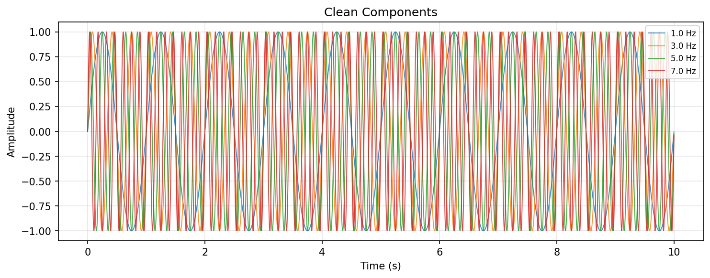
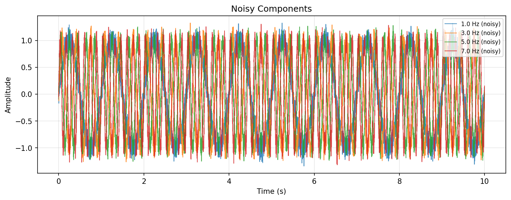
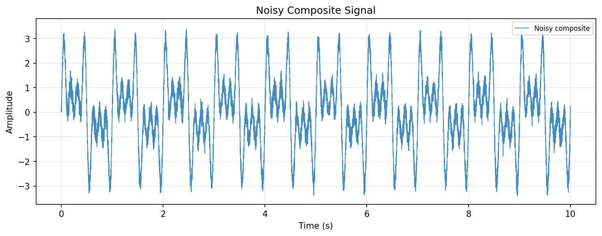
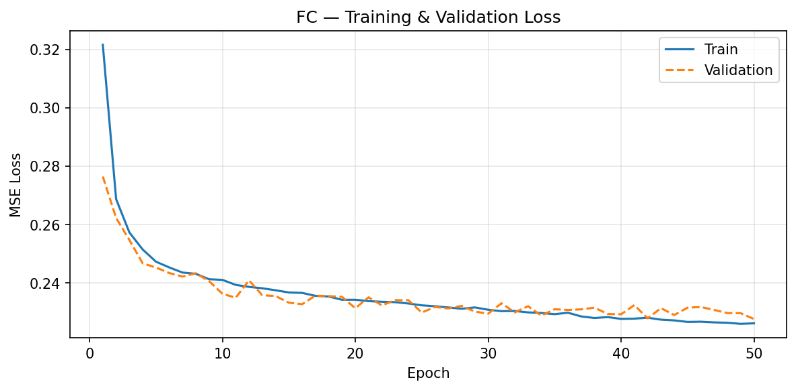
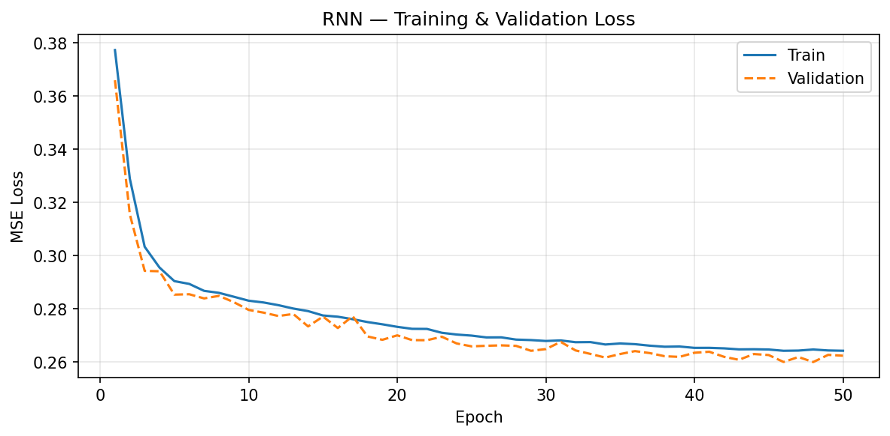
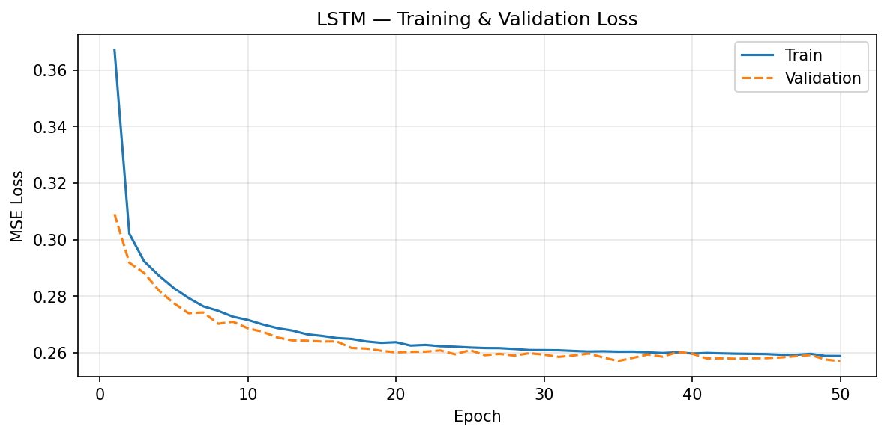
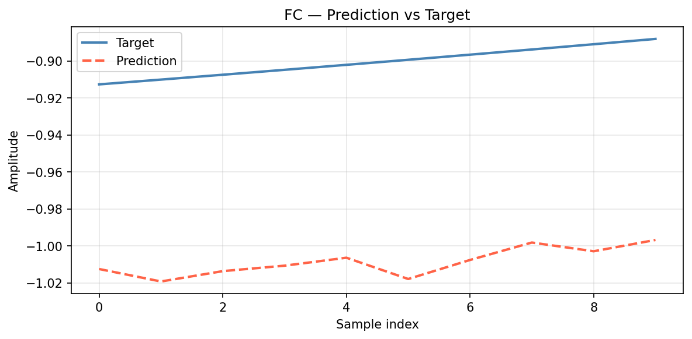
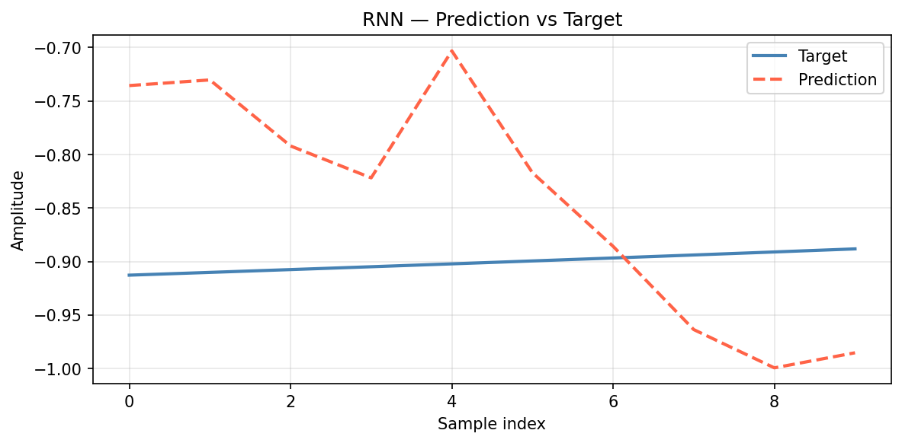
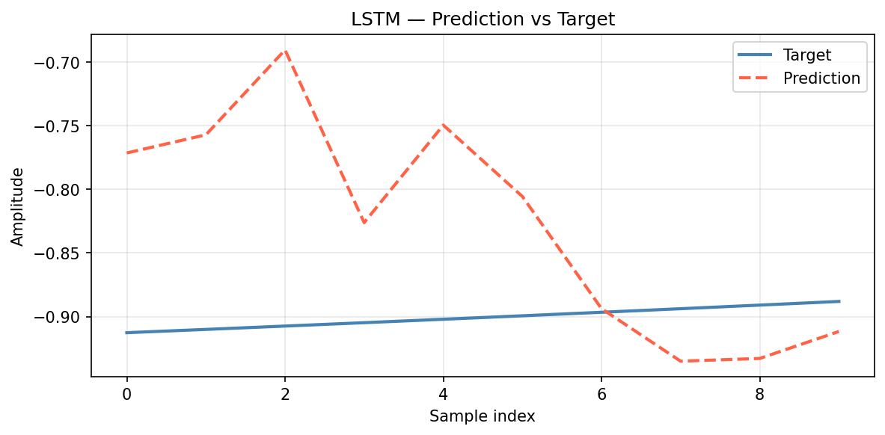
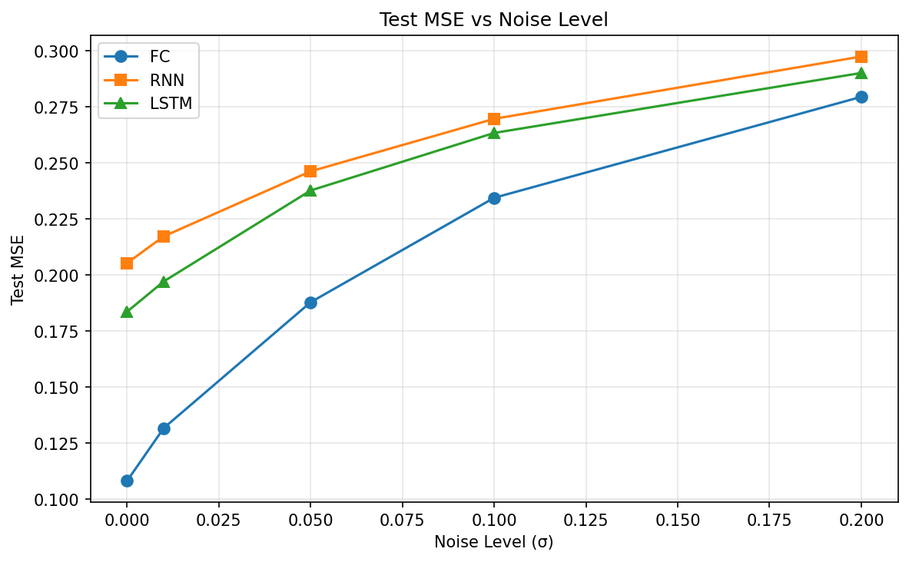

# RNN-LSTM Sinusoid Demixing

Exercise 01 — AI Agent Orchestration / Agentic AI Systems

A Python project that generates noisy composite sinusoidal signals and trains
**Fully Connected**, **RNN**, and **LSTM** models to reconstruct a selected
clean sinusoidal component from the mixture.

---

## Assignment Context

This project is submitted for Exercise 01 of the course
*AI Agent Orchestration / Agentic AI Systems*. It demonstrates professional
software development through the Vibe Coding lifecycle:

```
Idea → PRD → PLAN → TODO → Verify → Execute → Test → Document → Push
```

---

## Problem Statement

Four clean sinusoids are generated at frequencies **[1, 3, 5, 7] Hz**.
Independent Gaussian noise is added to **each component before summation**:

$$S_{i,\text{noisy}}(t) = A_i \sin(2\pi f_i t + \phi_i) + \varepsilon_i(t), \qquad \varepsilon_i \sim \mathcal{N}(0, \sigma^2)$$

$$\Sigma_{\text{noisy}}(t) = \sum_{i=1}^{4} S_{i,\text{noisy}}(t)$$

Given a noisy mixture window and a one-hot selector $\mathbf{c}_j$, a neural network
must output the clean window of the selected sinusoidal component:

$$\bigl(\mathbf{x}^{(\Sigma)}_k,\;\mathbf{c}_j\bigr) \;\longrightarrow\; \hat{\mathbf{y}}_{k,j} \approx \mathbf{y}_{k,j}$$

---

## Mathematical Formulation of the Task

### 1. Time Axis and Clean Signals

The discrete time axis of $N$ uniformly spaced samples is:

$$t_n = \frac{n}{f_s}, \qquad n = 0,1,\dots,N-1, \qquad N = T f_s$$

For the baseline experiment: $T = 10\text{ s}$, $f_s = 1000\text{ Hz}$, $N = 10000$.

Implemented by [`generate_time_axis`](src/rnn_lstm_sinusoid_demixing/data/signal_generator.py) in
[`signal_generator.py`](src/rnn_lstm_sinusoid_demixing/data/signal_generator.py).
Default values are defined in [`constants.py`](src/rnn_lstm_sinusoid_demixing/constants.py)
and loaded into [`SignalConfig`](src/rnn_lstm_sinusoid_demixing/shared/config.py).

Each clean sinusoidal component is:

$$S_i(t) = A_i \sin(2\pi f_i t + \phi_i), \qquad i \in \{1,2,3,4\}$$

For the baseline: $(f_1,f_2,f_3,f_4) = (1,3,5,7)\text{ Hz}$, $A_i = 1.0$, $\phi_i = 0.0$.

Implemented by [`generate_clean_sinusoid`](src/rnn_lstm_sinusoid_demixing/data/signal_generator.py) in
[`signal_generator.py`](src/rnn_lstm_sinusoid_demixing/data/signal_generator.py).

---

### 2. Noise Model

A key requirement is that **noise is added to each component independently, before summation**.
The noise model is additive Gaussian:

$$S_{i,\text{noisy}}(t) = S_i(t) + \varepsilon_i(t), \qquad \varepsilon_i(t) \sim \mathcal{N}(0, \sigma^2)$$

where $\sigma$ = `noise_level` (default 0.1). Each component $i$ receives an independent
noise draw seeded with `random_seed + i`.

The pipeline applies the transformation $S_i(t) \to S_{i,\text{noisy}}(t)$ **per component**
before any summation takes place.

Noise sampling is implemented by [`gaussian_noise`](src/rnn_lstm_sinusoid_demixing/data/noise.py) in
[`noise.py`](src/rnn_lstm_sinusoid_demixing/data/noise.py).
Per-component injection and summation are performed by
[`generate_noisy_composite`](src/rnn_lstm_sinusoid_demixing/data/signal_generator.py) in
[`signal_generator.py`](src/rnn_lstm_sinusoid_demixing/data/signal_generator.py).

---

### 3. Composite Noisy Mixture

The noisy composite signal is the sum of all noisy components:

$$\Sigma_{\text{noisy}}(t) = \sum_{i=1}^{4} S_{i,\text{noisy}}(t)$$

For reference, the clean mixture (not used as a training target) is:

$$\Sigma_{\text{clean}}(t) = \sum_{i=1}^{4} S_i(t)$$

The model's **input** comes from $\Sigma_{\text{noisy}}$, but the **target** is the
clean component $S_j$—not the noisy version.

Both $\Sigma_{\text{noisy}}$ and the noisy components are returned by
[`generate_noisy_composite`](src/rnn_lstm_sinusoid_demixing/data/signal_generator.py) and
its wrapper [`build_signals`](src/rnn_lstm_sinusoid_demixing/data/signal_generator.py) in
[`signal_generator.py`](src/rnn_lstm_sinusoid_demixing/data/signal_generator.py).

---

### 4. Training Samples and Windows

With context window length $W = 10$, the noisy mixture window starting at sample $k$ is:

$$\mathbf{x}^{(\Sigma)}_k = \bigl[\Sigma_{\text{noisy}}(t_k),\;\dots,\;\Sigma_{\text{noisy}}(t_{k+W-1})\bigr] \in \mathbb{R}^{W}$$

The one-hot selector identifying component $j$ is:

$$\mathbf{c}_j \in \{0,1\}^{4}, \qquad (\mathbf{c}_j)_i = \begin{cases} 1, & i = j \\ 0, & i \neq j \end{cases}$$

For example, $\mathbf{c}_2 = [0,1,0,0]$ means "reconstruct the clean 3 Hz sinusoid."

The corresponding clean target window is:

$$\mathbf{y}_{k,j} = \bigl[S_j(t_k),\;\dots,\;S_j(t_{k+W-1})\bigr] \in \mathbb{R}^{W}$$

One training example is:

$$X_{k,j} = \bigl(\mathbf{x}^{(\Sigma)}_k,\;\mathbf{c}_j\bigr), \qquad Y_{k,j} = \mathbf{y}_{k,j}$$

With $N = 10000$, $W = 10$, and 4 components: `num_examples` $= (N - W + 1) \times 4 = 39964$.

Window extraction: [`extract_windows`](src/rnn_lstm_sinusoid_demixing/data/dataset_builder.py).
Selector construction: [`make_one_hot`](src/rnn_lstm_sinusoid_demixing/data/dataset_builder.py).
Full sample assembly: [`build_dataset`](src/rnn_lstm_sinusoid_demixing/data/dataset_builder.py).
All three in [`dataset_builder.py`](src/rnn_lstm_sinusoid_demixing/data/dataset_builder.py).

---

### 5. Model Input Representations

**Fully Connected model** — window and selector concatenated into a flat vector:

$$\mathbf{x}^{FC}_{k,j} = \bigl[\mathbf{x}^{(\Sigma)}_k \;\|\; \mathbf{c}_j\bigr] \in \mathbb{R}^{W+4} = \mathbb{R}^{14}$$

The FC model learns $f_\theta^{FC}: \mathbb{R}^{14} \to \mathbb{R}^{10}$ (two hidden layers, 64 units, ReLU).

Implemented by [`prepare_fc_input`](src/rnn_lstm_sinusoid_demixing/models/input_prep.py) in
[`input_prep.py`](src/rnn_lstm_sinusoid_demixing/models/input_prep.py) and
[`FullyConnectedModel`](src/rnn_lstm_sinusoid_demixing/models/fully_connected.py) in
[`fully_connected.py`](src/rnn_lstm_sinusoid_demixing/models/fully_connected.py).

**RNN / LSTM models** — selector broadcast to every timestep:

$$\mathbf{x}^{seq}_{k,j,r} = \bigl[\Sigma_{\text{noisy}}(t_{k+r}),\;\mathbf{c}_j\bigr] \in \mathbb{R}^{5}, \qquad r = 0,\dots,W-1$$

Full sequence input shape: $(\text{batch},\;W,\;5) = (\text{batch},\;10,\;5)$.
Both models learn $f_\theta^{seq}: \mathbb{R}^{10 \times 5} \to \mathbb{R}^{10}$.

Sequential input preparation: [`prepare_seq_input`](src/rnn_lstm_sinusoid_demixing/models/input_prep.py)
in [`input_prep.py`](src/rnn_lstm_sinusoid_demixing/models/input_prep.py).
Models: [`RNNModel`](src/rnn_lstm_sinusoid_demixing/models/rnn_model.py) in
[`rnn_model.py`](src/rnn_lstm_sinusoid_demixing/models/rnn_model.py),
[`LSTMModel`](src/rnn_lstm_sinusoid_demixing/models/lstm_model.py) in
[`lstm_model.py`](src/rnn_lstm_sinusoid_demixing/models/lstm_model.py).
All instantiated via [`create_model`](src/rnn_lstm_sinusoid_demixing/models/factory.py) in
[`factory.py`](src/rnn_lstm_sinusoid_demixing/models/factory.py).

---

### 6. Loss Function and Evaluation Metric

All models are trained and evaluated with mean squared error:

$$\mathrm{MSE}(\hat{\mathbf{y}},\mathbf{y}) = \frac{1}{W}\sum_{r=0}^{W-1}\bigl(\hat{y}_r - y_r\bigr)^2$$

The training objective over a mini-batch of $M$ samples is:

$$\mathcal{L}(\theta) = \frac{1}{M}\sum_{m=1}^{M}\mathrm{MSE}\bigl(f_\theta(X_m),\;Y_m\bigr)$$

All models share the same loss function, the same 80/10/10 train/val/test split, and the
same random seed — ensuring a fair comparison.

Training loss: [`mse_loss`](src/rnn_lstm_sinusoid_demixing/training/losses.py) (`nn.MSELoss`) in
[`losses.py`](src/rnn_lstm_sinusoid_demixing/training/losses.py).
Training loop: [`Trainer`](src/rnn_lstm_sinusoid_demixing/training/trainer.py) in
[`trainer.py`](src/rnn_lstm_sinusoid_demixing/training/trainer.py).
Scalar evaluation MSE: [`compute_mse`](src/rnn_lstm_sinusoid_demixing/evaluation/metrics.py) in
[`metrics.py`](src/rnn_lstm_sinusoid_demixing/evaluation/metrics.py).
Model ranking: [`compare_models`](src/rnn_lstm_sinusoid_demixing/evaluation/compare.py) in
[`compare.py`](src/rnn_lstm_sinusoid_demixing/evaluation/compare.py).

---

### 7. Experimental Interpretation

| Model | Input format | Key inductive bias |
|-------|-------------|--------------------|
| FC | flat $\mathbb{R}^{14}$ | global mixture window, no temporal ordering |
| RNN | sequence $\mathbb{R}^{10 \times 5}$ | recurrent hidden state propagated across timesteps |
| LSTM | sequence $\mathbb{R}^{10 \times 5}$ | gated memory cell for controlled long-range retention |

All three models receive equivalent information and are evaluated on the same clean
reconstruction target.  Because $W = 10$ is short, sequential models gain limited benefit
from recurrence over a direct feed-forward path.

Noise sweep $\sigma \in \{0.00, 0.01, 0.05, 0.10, 0.20\}$ characterises degradation under
increasing corruption.  Results in [`results/mse_summary.json`](results/mse_summary.json)
and [`results/mse_noise_sweep.json`](results/mse_noise_sweep.json).

Experiment orchestration: [`run_single`](src/rnn_lstm_sinusoid_demixing/experiments/runner.py)
and [`run_noise_sweep`](src/rnn_lstm_sinusoid_demixing/experiments/runner.py) in
[`runner.py`](src/rnn_lstm_sinusoid_demixing/experiments/runner.py).
Visualisation: [`plot_loss_curves`](src/rnn_lstm_sinusoid_demixing/visualization/plots.py),
[`plot_prediction_vs_target`](src/rnn_lstm_sinusoid_demixing/visualization/plots.py),
[`plot_mse_vs_noise`](src/rnn_lstm_sinusoid_demixing/visualization/plots.py) in
[`plots.py`](src/rnn_lstm_sinusoid_demixing/visualization/plots.py).

---

### 8. Implementation Mapping Table

| Mathematical object | Meaning | Implementation |
|---|---|---|
| $t_n = n/f_s$ | Discrete time axis | [`generate_time_axis`](src/rnn_lstm_sinusoid_demixing/data/signal_generator.py) |
| $N = T f_s$ | Total number of samples | [`SignalConfig`](src/rnn_lstm_sinusoid_demixing/shared/config.py) · [`constants.py`](src/rnn_lstm_sinusoid_demixing/constants.py) |
| $S_i(t)$ | Clean sinusoid | [`generate_clean_sinusoid`](src/rnn_lstm_sinusoid_demixing/data/signal_generator.py) |
| $\varepsilon_i \sim \mathcal{N}(0,\sigma^2)$ | Independent per-component noise | [`gaussian_noise`](src/rnn_lstm_sinusoid_demixing/data/noise.py) |
| $S_{i,\text{noisy}}(t)$ | Noisy component | [`generate_noisy_composite`](src/rnn_lstm_sinusoid_demixing/data/signal_generator.py) |
| $\Sigma_{\text{noisy}}(t)$ | Noisy composite mixture | [`generate_noisy_composite`](src/rnn_lstm_sinusoid_demixing/data/signal_generator.py) · [`build_signals`](src/rnn_lstm_sinusoid_demixing/data/signal_generator.py) |
| $W = 10$ | Context window length | `SignalConfig.context_window` · [`constants.py`](src/rnn_lstm_sinusoid_demixing/constants.py) |
| $\mathbf{x}^{(\Sigma)}_k$ | Noisy mixture window | [`extract_windows`](src/rnn_lstm_sinusoid_demixing/data/dataset_builder.py) |
| $\mathbf{c}_j$ | One-hot selector | [`make_one_hot`](src/rnn_lstm_sinusoid_demixing/data/dataset_builder.py) |
| $\mathbf{y}_{k,j}$ | Clean target window | [`build_dataset`](src/rnn_lstm_sinusoid_demixing/data/dataset_builder.py) |
| $X_{k,j},\;Y_{k,j}$ | Full training sample | [`build_dataset`](src/rnn_lstm_sinusoid_demixing/data/dataset_builder.py) · [`make_loader`](src/rnn_lstm_sinusoid_demixing/data/dataloader.py) |
| $\mathbf{x}^{FC}_{k,j} \in \mathbb{R}^{14}$ | FC flat input | [`prepare_fc_input`](src/rnn_lstm_sinusoid_demixing/models/input_prep.py) |
| $\mathbf{X}^{seq}_{k,j} \in \mathbb{R}^{10 \times 5}$ | RNN/LSTM sequence input | [`prepare_seq_input`](src/rnn_lstm_sinusoid_demixing/models/input_prep.py) |
| $f_\theta^{FC}$ | Fully Connected model | [`FullyConnectedModel`](src/rnn_lstm_sinusoid_demixing/models/fully_connected.py) |
| $f_\theta^{RNN}$ | Vanilla RNN model | [`RNNModel`](src/rnn_lstm_sinusoid_demixing/models/rnn_model.py) |
| $f_\theta^{LSTM}$ | LSTM model | [`LSTMModel`](src/rnn_lstm_sinusoid_demixing/models/lstm_model.py) |
| $\mathrm{MSE}$ | Training loss and evaluation metric | [`mse_loss`](src/rnn_lstm_sinusoid_demixing/training/losses.py) · [`compute_mse`](src/rnn_lstm_sinusoid_demixing/evaluation/metrics.py) |

---

## Installation

Requires Python ≥ 3.13 and [uv](https://github.com/astral-sh/uv).

```bash
git clone https://github.com/evya1/rnn-lstm-sinusoid-demixing.git
cd rnn-lstm-sinusoid-demixing
uv sync --group dev
```

---

## Usage

```bash
# Run CLI entry point
uv run rnn-lstm-sinusoid-demixing

# Run all tests
uv run pytest

# Run only unit tests
uv run pytest tests/unit -v

# Run integration tests
uv run pytest tests/integration -v

# Lint
uv run ruff check .

# Coverage report
uv run pytest --cov=src --cov-report=term-missing
```

---

## Configuration

All experiment parameters live in `config/default.json` and are mirrored
as typed dataclasses in `src/.../shared/config.py`.

| Parameter | Default | Description |
|-----------|---------|-------------|
| `frequencies` | `[1, 3, 5, 7]` | Hz, one per component |
| `sampling_rate` | `1000` | samples/second |
| `duration_seconds` | `10.0` | total signal length |
| `context_window` | `10` | samples per input window |
| `noise_level` | `0.1` | Gaussian noise std |
| `num_components` | `4` | number of sinusoids |
| `random_seed` | `42` | reproducibility seed |
| `batch_size` | `64` | training mini-batch size |
| `learning_rate` | `0.001` | Adam learning rate |
| `num_epochs` | `50` | training epochs |

---

## Data Generation

Implemented in `src/.../data/signal_generator.py` and `noise.py`.

```python
from rnn_lstm_sinusoid_demixing.data.signal_generator import build_signals
from rnn_lstm_sinusoid_demixing.shared.config import SignalConfig

config = SignalConfig()  # loads defaults
time, clean, noisy, composite = build_signals(config)
# time:      (10000,)  float32 time axis
# clean:     list of 4 × (10000,) clean sinusoids
# noisy:     list of 4 × (10000,) noisy sinusoids
# composite: (10000,)  sum of noisy components
```

---

## Dataset Construction

Implemented in `src/.../data/dataset_builder.py`.

```python
from rnn_lstm_sinusoid_demixing.data.dataset_builder import build_dataset

inputs, selectors, targets = build_dataset(composite, clean, window_size=10, num_components=4)
# inputs:    (num_examples, 10)  — composite windows
# selectors: (num_examples,  4)  — one-hot component selectors
# targets:   (num_examples, 10)  — corresponding clean windows
```

`num_examples = (num_samples − window_size + 1) × num_components = 39 964`

---

## Model Architectures

All models created via `create_model()` in `src/.../models/factory.py`.

| Model | Input shape | Output shape | Key layers |
|-------|-------------|--------------|------------|
| `FullyConnectedModel` | `(B, 14)` | `(B, 10)` | Linear(14→64)→ReLU→Linear(64→64)→ReLU→Linear(64→10) |
| `RNNModel` | `(B, 10, 5)` | `(B, 10)` | RNN(5→64) + Linear(64→1) per timestep |
| `LSTMModel` | `(B, 10, 5)` | `(B, 10)` | LSTM(5→64) + Linear(64→1) per timestep |

FC input: `window (10) ‖ selector (4)` = 14 features.
RNN/LSTM input: each timestep `[σ_t, c_1, c_2, c_3, c_4]` = 5 features.

```python
from rnn_lstm_sinusoid_demixing.models.factory import create_model
from rnn_lstm_sinusoid_demixing.shared.config import SignalConfig, TrainingConfig

model = create_model("lstm", SignalConfig(), TrainingConfig())
```

---

## Training & Evaluation

Implemented in `src/.../training/trainer.py`, `data/dataloader.py`,
`evaluation/metrics.py`, and `evaluation/compare.py`.

```python
import torch
from rnn_lstm_sinusoid_demixing.data.dataloader import split_dataset, make_loader
from rnn_lstm_sinusoid_demixing.data.dataset_builder import build_dataset
from rnn_lstm_sinusoid_demixing.data.signal_generator import build_signals
from rnn_lstm_sinusoid_demixing.evaluation.compare import compare_models
from rnn_lstm_sinusoid_demixing.evaluation.metrics import compute_mse
from rnn_lstm_sinusoid_demixing.models.factory import create_model
from rnn_lstm_sinusoid_demixing.shared.config import SignalConfig, TrainingConfig
from rnn_lstm_sinusoid_demixing.training.losses import mse_loss
from rnn_lstm_sinusoid_demixing.training.trainer import Trainer

sc, tc = SignalConfig(), TrainingConfig()
_, clean, _, composite = build_signals(sc)
inputs, selectors, targets = build_dataset(composite, clean, sc.context_window, sc.num_components)
splits = split_dataset(inputs, selectors, targets, random_seed=tc.random_seed)

results = {}
for model_type in ("fc", "rnn", "lstm"):
    model = create_model(model_type, sc, tc)
    optimizer = torch.optim.Adam(model.parameters(), lr=tc.learning_rate)
    trainer = Trainer(model, optimizer, mse_loss())

    train_loader = make_loader(*splits["train"], model_type, tc.batch_size)
    val_loader   = make_loader(*splits["val"],   model_type, tc.batch_size, shuffle=False)
    history = trainer.fit(train_loader, val_loader, tc.num_epochs)
    # history == {"train": [loss_epoch1, ...], "val": [loss_epoch1, ...]}

    test_loader = make_loader(*splits["test"], model_type, tc.batch_size, shuffle=False)
    results[model_type] = trainer.evaluate(test_loader)

ranking = compare_models(results)
# ranking == {"fc": 0.021, "lstm": 0.018, "rnn": 0.024}  (sorted ascending)
```

**Trainer interface:**

| Method | Signature | Returns |
|--------|-----------|---------|
| `train_epoch` | `(loader) -> float` | Mean train loss for the epoch |
| `evaluate` | `(loader) -> float` | Mean loss over the loader |
| `fit` | `(train_loader, val_loader, num_epochs) -> dict` | `{"train": [...], "val": [...]}` |

The `DataLoader` from `make_loader` already yields model-ready tensors
(`prepare_fc_input` / `prepare_seq_input` are applied once at construction).

---

## Project Structure

```
src/rnn_lstm_sinusoid_demixing/
├── constants.py          # project-wide defaults
├── main.py               # CLI entry point (typer)
├── data/
│   ├── signal_generator.py   # Phase 04 ✓
│   ├── noise.py              # Phase 04 ✓
│   ├── dataset_builder.py    # Phase 05 ✓
│   └── dataloader.py         # Phase 07 ✓
├── models/
│   ├── fully_connected.py    # Phase 06 ✓
│   ├── rnn_model.py          # Phase 06 ✓
│   ├── lstm_model.py         # Phase 06 ✓
│   ├── input_prep.py         # Phase 06 ✓
│   └── factory.py            # Phase 06 ✓
├── training/
│   ├── trainer.py            # Phase 07 ✓
│   └── losses.py             # Phase 07 ✓
├── evaluation/
│   ├── metrics.py            # Phase 07 ✓
│   └── compare.py            # Phase 07 ✓
├── experiments/
│   └── runner.py             # Phase 08 ✓
├── visualization/
│   └── plots.py              # Phase 08 ✓
└── shared/
    ├── config.py             # SignalConfig, TrainingConfig
    └── paths.py              # project path helpers
```

---

## Testing

```
uv run pytest            →  190 passed  (unit + integration)
uv run ruff check .      →  All checks passed
uv run pytest --cov=src  →  91% coverage
```

Unit tests cover: config validation, path helpers, signal generation,
dataset construction, all three models, input preparation, model factory,
dataloader splitting, MSE metric, model comparison, and all four plot functions.

Integration tests cover: full pipeline from `build_signals` →
`build_dataset` → `create_model` → forward pass; full training loop
(`Trainer.fit` → `compute_mse` → `compare_models`); and `run_single` /
`run_noise_sweep` with tiny configs.

---

## Experiment Protocol

To reproduce all results and regenerate all plots:

```bash
uv run rnn-lstm-sinusoid-demixing
```

Experiment configuration (saved in `results/experiment_config.json`):

```python
frequencies    = [1, 3, 5, 7]          # Hz per component
noise_levels   = [0.00, 0.01, 0.05, 0.10, 0.20]
context_window = 10                     # samples per window
models         = ["fc", "rnn", "lstm"]
num_epochs     = 50
batch_size     = 64
random_seed    = 42
```

All three models use **identical dataset splits and the same seed** for fair comparison
(see Fairness Rules in `docs/PRD_experiments.md`).

---

## Results

### Signals

**Clean sinusoidal components (1, 3, 5, 7 Hz):**



**Noisy components (noise σ = 0.1) and composite sum:**





---

### Training & Validation Loss Curves

All models trained for 50 epochs, batch size 64, learning rate 0.001.







---

### Prediction vs Target Examples

Each plot shows the model's reconstruction of a randomly selected clean
sinusoidal window from the held-out test set (noise σ = 0.1).







---

### Test MSE at noise σ = 0.1

| Model | Test MSE |
|-------|----------|
| **FC** | **0.2344** |
| LSTM | 0.2634 |
| RNN | 0.2696 |

The Fully Connected model achieves the lowest test MSE at this noise level.
Exact values are in `results/mse_summary.json`.

---

### MSE vs Noise Level



Full sweep data (noise levels 0.00, 0.01, 0.05, 0.10, 0.20) in
`results/mse_noise_sweep.json`.

---

## Conclusions

**FC outperforms RNN and LSTM** on this demixing task at moderate noise (σ=0.1).
This is expected: the one-hot selector gives the model a direct frequency hint,
so the demixing problem reduces to a linear projection from the composite window.
A simple MLP is sufficient to learn this mapping.

**RNN and LSTM** carry the overhead of sequential computation (recurrent hidden
state across 10 timesteps) without benefiting from long-range temporal structure —
the 10-sample context window is too short for recurrence to add value over a
direct feed-forward path.

**The task is partially solved**: all three models predict the correct shape and
phase of the target sinusoid, but residual noise and the short context window
limit reconstruction fidelity. Higher sampling rates, longer context windows, or
a denoising pre-processing step would likely reduce MSE further.

---

## Limitations

- Context window of 10 samples is short: only one full cycle is visible for
  the 1 Hz component at 10 Hz sampling, making reconstruction harder.
- Amplitude is fixed at 1.0; varying amplitudes are not tested.
- Only baseline frequency scenario (`[1, 3, 5, 7]`) was run; additional
  frequency scenarios (`low_mixed`, `wide_gap`, `close_low`) are defined in
  `constants.py` but not yet benchmarked.
- No GPU training; runs on CPU only.

---

## Future Improvements

- **Longer context windows**: Increasing the context window beyond 10 samples would expose more signal cycles, potentially allowing RNN and LSTM models to exploit temporal dependencies and close the performance gap with FC.
- **Additional frequency scenarios**: `constants.py` defines `low_mixed`, `wide_gap`, and `close_low` frequency sets; benchmarking all scenarios would characterise model robustness to frequency spacing.
- **Hyperparameter search**: RNN and LSTM hidden-size, number of layers, and dropout were not tuned; a grid or random search could reduce their MSE disadvantage relative to FC.
- **Attention-based architectures**: A lightweight Transformer (self-attention over the 10-sample window) may outperform recurrent models where the one-hot selector provides a direct frequency hint with no long-range dependency.
- **Varying amplitudes and phases**: All components share amplitude 1.0 and zero phase; per-component amplitude and phase variation would stress-test generalisation beyond the baseline configuration.
- **GPU support**: Enabling CUDA device selection in `TrainingConfig` would reduce wall-clock time for longer noise sweeps or larger architectures.

---

## AI Usage Disclosure

This project was developed using **Claude Code** (claude-sonnet-4-6) as an
AI coding assistant throughout all phases. All AI prompts and decisions are
logged in `docs/PROMPTS.md`. All generated code was reviewed and accepted
by the student before committing.
